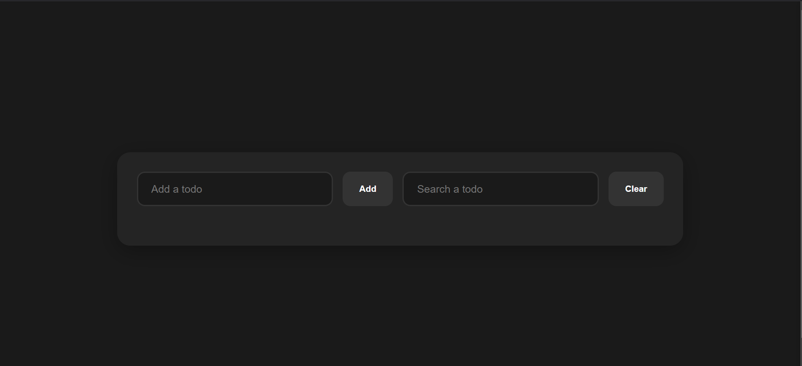

# Todo List Project

## Introduction

The Todo List project is a simple task management application that allows users to add, edit, delete, and search for tasks. This application is built with a Next.js frontend and a Rust backend.

**Main Screen:**
---

---
**How to working:**
---
 
---
## Technologies Used

- **Frontend**: Next.js
- **Backend**: Rust
- **Libraries**: React, Axios, Date-fns, Actix-web, chrono, actix-cors, uuid, serde, serde_json, serde_derive, chrono, uuid
- **Icons**: React Icons

## Installation

### Requirements

- Node.js
- Cargo

### Installation Guide

1. **Clone the repository**

   ```bash
   git clone https://github.com/PhucLam202/TodoApp.git
   cd TodoApp
   ```

2. **Install frontend**

   ```bash
   cd FE-Todo
   npm install
   npm run dev
   ```

   Open your browser and go to `http://localhost:3000` to view the application.

3. **Install backend**

   ```bash
   cd rust
   cargo run
   ```

   The backend will run on `http://localhost:8080`.

## Usage

- **Add a task**: Enter the task name in the "Add a todo" field and click "Add".
- **Edit a task**: Click the pencil icon to edit a task.
- **Delete a task**: Click the trash icon to delete a task.
- **Search for a task**: Enter a keyword in the "Search a todo" field to search.

## Project Structure

- **frontend/**: Contains the source code for the frontend using **Next.js**.
- **backend/**: Contains the source code for the backend using **Rust**.

## Contributing

If you want to contribute to the project, please create a pull request or open an issue on GitHub.